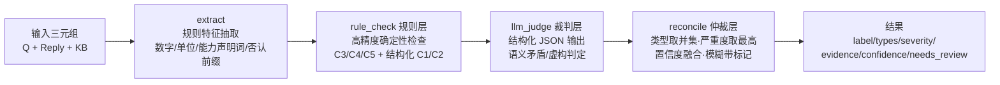

# 需求文档 — 客服回复幻觉检测系统（HalluGuard）

> 版本 v1.0 ｜ 2026-09-29 ｜ 状态：设计定稿
> 任务：0110 · 客服回复幻觉检测 —— 批量检测智能客服"说瞎话"的回复，并与人工标注对比计算漏检/误报。

---

## 1. 背景与目标

智能客服系统在知识库（KB）之外"说瞎话"：编造不存在的优惠政策、给出错误退货地址、杜撰产品参数、假装具备查询/修改能力。业务方需要一个可复现的批量检测工具：

- 对 20 条客服回复逐条检测并输出结构化标注；
- 与 `data/task4_ground_truth.json` 人工标注对比，计算漏检（FN）/误报（FP）；
- 对易误判 case 给出归因分析。

## 2. 幻觉分类体系（5 类 × 3 级严重度）

对 ground truth 的 9 种零散标签做 MECE 归纳，收敛为 5 类：

| 编号 | 类别 | 定义 | 典型 case（GT 标签） | 严重度 |
|------|------|------|----------------------|--------|
| C1 | 事实矛盾 Contradiction | 回复断言与 KB 明确记载**直接冲突** | h01 退货政策(政策偏差)、h02 蓝牙版本、h06 材质/保修、h08 发货/快递、h17 接口、h04 纸质发票(政策偏差) | HIGH |
| C2 | 无据虚构 Fabrication | 编造 KB 中**不存在的**实体、入口或承诺（KB 无记载或显式否认） | h05 优惠券(优惠编造)、h07 退货地址(信息编造)、h09 NFC、h11 线下门店(信息编造)、h15 品牌关联(信息编造)、h19 学生优惠(优惠编造) | HIGH |
| C3 | 能力越界 Capability Overreach | 声称执行了系统**不具备的接口能力**（假装查过/改过/升级过） | h03 物流查询、h10 退款进度、h14 修改地址、h18 工单升级（均为能力越界） | HIGH |
| C4 | 安全误导 Safety Misguidance | 涉及健康/安全的关键信息误导 | h13 孕妇可用(安全误导) | CRITICAL |
| C5 | 信息遗漏 Omission | 遗漏 KB 中的关键限定信息导致建议失真 | h20 尺码反馈(信息遗漏，边界模糊) | LOW |
| — | 无幻觉 | 回复与 KB 一致 | h12 支付方式、h16 色差说明 | — |

设计要点：
- **C1 vs C2 的边界**：KB 有明确记载且冲突 → C1；KB 无记载/显式否认而回复断言 → C2。h09（KB"未标注 NFC"）归 C2 而非 C1。
- **部分正确**（h04）：电子发票正确 + 纸质发票错误 → 归 C1，`partial=true`，severity 降为 MEDIUM。
- **一条多类**（h05）：主类 C2，副类（"直接发到账户"的能力越界承诺）记入 evidence，不重复计数主标签。
- **严重度依据业务风险**：健康安全 > 资损/能力欺骗 > 一般参数错误 > 建议失真。

## 3. 检测方法（三层流水线，LangGraph 编排）



**分工原则：规则能确定性兜底的绝不过模型。**

- **规则层**（高精度，零成本）：
  - `capability_overreach`：KB 声明"未接入/不具备 XX 接口" + 回复出现"查了/已修改/已升级"类能力声明词 → C3 确定性命中；
  - `safety_misguidance`：KB 对特定人群有警示 + 回复给"放心用"类绿灯 → C4；
  - `omission_absolute_claim`：KB 含用户反馈统计 + 回复绝对化断言 → C5（低置信，标 needs_review）；
  - 结构化 C1/C2：满减券集合成员校验、快递公司集合校验、接口字段冲突、"KB 显式否认 X + 回复肯定 X"（否定前缀感知）、"纯线上 + 宣称线下店"、退货地址泄露。
- **裁判层**（LLM-as-Judge）：
  - real 模式：OpenAI 兼容 API（DeepSeek 等），强制 JSON schema 输出，要求 evidence 必须引用 KB 原文片段，逐句校验并输出 partial 标志；解析失败降级为"仅规则结果"并打 `fallback=true`；
  - mock 模式：确定性模拟裁判（零外部依赖，离线可演示、可回归测试）。
- **仲裁层**：类型取并集、严重度取最高（客服幻觉资损/信誉成本不对称，宁可多报不漏报）、置信度加权融合、低置信进人工复核队列。

## 4. 功能需求

| 编号 | 需求 |
|------|------|
| FR1 | 单条检测：`(question, reply, knowledge_base) → {label, types[], severity, evidence[], confidence, needs_review, rule_hits[], judge_raw}` |
| FR2 | 批量检测：对 `data/task4_replies.json` 全量跑批，结果落盘 `backend/results/results.json` |
| FR3 | 评测对比：对齐 ground truth → 混淆矩阵 + 宏平均 P/R/F1 + 逐条对比表 + 漏检/误报清单 |
| FR4 | Mock/Real 双模式：`HALLU_MOCK=true` 零依赖演示；`false` 调真实 LLM API |
| FR5 | Web 看板：检测结果表（严重度徽章/证据对照/详情抽屉）+ 评测报告页（指标卡片/混淆矩阵/误判归因） |

## 5. 非功能需求

- NFR1 可复现：mock 模式零外部依赖，`uv sync && pytest` 全绿；
- NFR2 可扩展：新增规则 = 注册一个检查函数；换裁判模型 = 改 `.env` 配置；
- NFR3 结构化：LLM 输出强制 JSON，无 evidence 引用则降级为 NONE（防裁判自身幻觉）。

## 6. 原型

### 6.1 API 原型

| Method | Path | 说明 |
|--------|------|------|
| POST | `/api/detect` | 单条检测 `{question, reply, knowledge_base}` |
| POST | `/api/batch` | 全量跑批（20 条），返回逐条结果 |
| GET | `/api/eval` | 对比 ground truth → 指标 + 误判清单 |
| GET | `/api/health` | 健康检查（含 mock 状态） |

### 6.2 前端线框（Vue3，两页）

```
┌─ 检测看板 /detect ──────────────────────────────┐
│ [模式开关: MOCK ● / REAL ○]  [▶ 批量检测]        │
│ ┌──────────────────────────────────────────────┐│
│ │ ID  │ 回复摘要       │ 分类      │ 严重度│置信 ││
│ │ h01 │ 30天无理由...  │ C1 事实矛盾│ HIGH │0.92││
│ │ h04 │ 电子+纸质发票  │ C1 (partial)│ MED │0.71││
│ │ h13 │ 孕妇可放心用   │ C4 安全误导│ CRIT │0.95││
│ │ h20 │ 尺码标准不偏   │ C5 信息遗漏│ LOW  │0.55││ ←灰显"模糊带"
│ └──────────────────────────────────────────────┘│
│ 点击行 → 详情抽屉: KB原文 vs 回复对照 + 证据高亮   │
└─────────────────────────────────────────────────┘

┌─ 评测报告 /report ──────────────────────────────┐
│ ┌──────┐┌──────┐┌──────┐┌────────┐              │
│ │准确率 ││召回率 ││精确率 ││漏检/误报│             │
│ └──────┘└──────┘└──────┘└────────┘              │
│ 混淆矩阵 (预测×真实)   │ 漏检清单 / 误报清单      │
│                        │ + 每条误判归因标签       │
└─────────────────────────────────────────────────┘
```

### 6.3 项目结构

```
huanjue/
├── README.md REQUIREMENTS.md LICENSE .gitignore CHANGELOG.md
├── .github/workflows/ci.yml      # ruff + pytest
├── data/                          # task4_replies.json / task4_ground_truth.json
├── backend/
│   ├── pyproject.toml  .env.example
│   ├── app/
│   │   ├── main.py config.py
│   │   ├── core/     taxonomy.py rules.py llm_judge.py detector.py
│   │   ├── graph/    workflow.py   # LangGraph: extract→rule→judge→reconcile
│   │   ├── api/      routes.py
│   │   └── services/ eval_service.py
│   ├── scripts/run_eval.py        # CLI 一键跑批+评测
│   ├── results/                    # 跑批产物（results.json / eval_report.json）
│   └── tests/                      # unit + e2e（20 条全流程）
└── frontend/                       # Vue3 + Vite + Pinia
    └── src/views/ Detect.vue Report.vue
```

## 7. 边界与非目标

- 不做流式检测、不做多语言、不接真实客服系统（离线批处理）；
- h20 类边界样本允许置信度 ∈ [0.4, 0.6] 模糊带，看板灰显提示"需人工复核"；
- 规则在本数据集上校准，存在过拟合风险——real 模式 LLM 裁判承担泛化职责。

## 8. 里程碑

M1 分类体系+规则层 → M2 LLM 裁判+LangGraph 编排 → M3 Flask API → M4 Vue3 看板 → M5 评测+README → M6 误判归因分析
